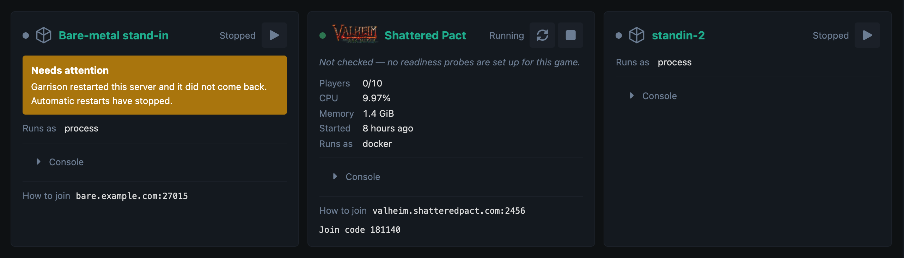
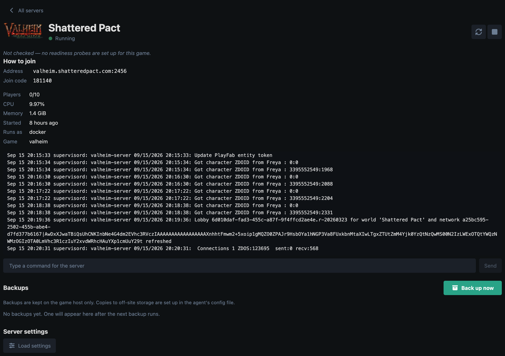
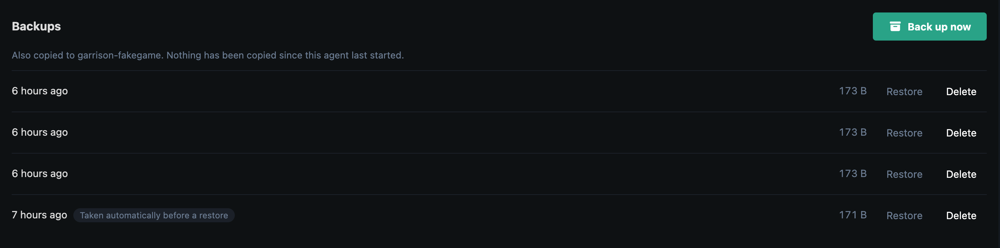
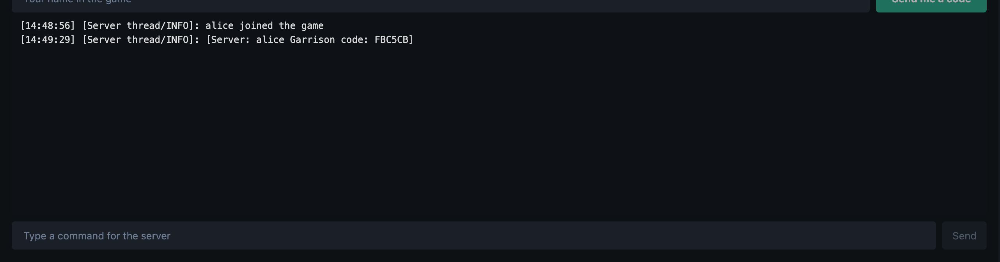
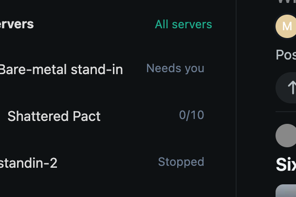
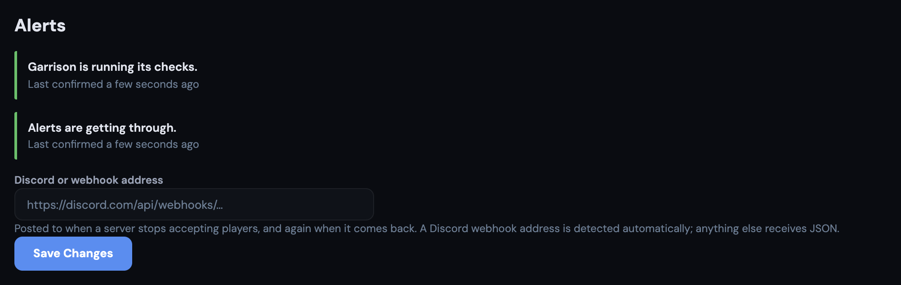

# Garrison

**Run your game servers from the forum your players already live in.**

Garrison puts your Minecraft, Valheim, ARK, Rust, Terraria or Factorio server on
your Flarum forum — its status, its console, and the people playing on it right
now. Any server you can install, with or without Docker.

**This package is free and MIT licensed**, and it covers one host and one
server: start, stop and restart, the console, the server pages, the widget, and
the alerting that tells you when a server has quietly stopped accepting players.
It is a whole product, not a trial, and it does not expire.
[Garrison Pro](#garrison-pro) adds backups, off-site copies, scheduled work,
config editing, in-game identity, and no limit on hosts or servers.



---

## Why it exists

A server that is *running* and a server that *players can join* are different
facts. Garrison was written after a Valheim server spent twenty hours up,
advertised, and unjoinable, with every dashboard in the world showing it green.

So Garrison checks readiness separately from state, and when something breaks it
climbs a ladder rather than thrashing: wait, restart, and — if restarting is
clearly not working — stop, say so, and leave it alone for a person. You are
told at every step, by forum notification, email and Discord.

---

## What you get

### A page for every server

Its state, its players, how to join it, what it is doing to the machine, its
console, its backups and its settings — at a URL you can link to. Every alert
links straight here, because "Shattered Pact stopped accepting players" followed
by a list of eleven servers is a search task at the worst possible moment.

`/garrison` and `/garrison/s/:id` are ordinary Flarum routes that Garrison
registers itself. They use your theme, your permissions and your login, and they
work on a forum with nothing else installed — there is no page builder, no CMS
and no template to assemble first.



### Backups you can actually restore from

Create, list, restore and delete. A **safety copy is taken automatically before
every restore**, so the most dangerous button in the product is reversible.
Restoring into a running server is refused — writing a world file under a live
process corrupts it hours before anyone notices — so Garrison stops the server
for you, restores, and leaves it stopped until you have checked.



### Copies somewhere else

To any S3-compatible provider — AWS S3, Backblaze B2, Cloudflare R2, Wasabi,
MinIO. Because the disaster your local backups do not cover is the one where
they were on the disk that died.

**The bucket keys live on your game host and never reach the forum.** The panel
tells you whether copies are landing, and shows the provider's own words when
they are not.

### The console



Live output, and a line you can type back. Retained, so the person who arrives
*after* something went wrong can still read what happened.

### Who is playing — and who they are on your forum

Garrison reads joins and leaves from the game's own log (presets for Minecraft,
Valheim, ARK, Rust, Terraria and Factorio) so you can see who is on right now. A
player can then prove an in-game character is theirs: Garrison whispers them a
code **in the game**, they type it on the forum, and their playtime appears on
their profile and on the server's leaderboard.

A leaderboard of in-game names is something any panel can show. One where the
names are people you can reply to is what only a panel living inside a community
can do.

### Scheduled work

Nightly restarts, backups, and messages to players — with advance warnings, which
are the difference between a restart and an outage. Day toggles and a clock, not
a cron field.

### Settings, without a file manager

Edit `server.properties` and friends from the forum — the files you choose, and
optionally only the keys you choose, so a moderator can change the message of the
day without being three lines from the RCON password. Comments in the file become
the help text. Editing rewrites one line in place, so your annotated config stays
annotated.

### A widget too, wherever you keep widgets

Separately from the pages above — which need nothing — Garrison offers a compact
server-status widget to Flarum's own sidebar, [fof/forum-widgets-core],
[Bespoke] and [Page Builder]. The stock sidebar is built in and needs no extra
extension; the other three are picked up only if you already run them.



Details, and the one gotcha worth knowing about Page Builder, are in
**[docs/widgets.md](docs/widgets.md)**.

[fof/forum-widgets-core]: https://github.com/FriendsOfFlarum/forum-widgets-core
[Bespoke]: https://ernestdefoe.online
[Page Builder]: https://ernestdefoe.online

---

## How it is built

An **agent** — one small Go binary — runs on your game host and **dials out** to
the forum. No inbound port, no port forward, no static IP. The box under your
desk works.

It speaks a **closed set of verbs** and nothing else. A forum that is completely
compromised can restart a server you already configured; it cannot ask for a
shell, because there is no verb through which it could. Every path, command and
credential lives on the host, in a file only you can write.

Docker is optional and always was. Most game servers in the world are a folder
from SteamCMD with a start script, and those are first-class here.

### And it tells you when it is not working

Garrison depends on your forum's scheduler and its queue worker, and neither
announces its absence — a forum with no cron entry runs none of this and looks
entirely normal. So Garrison pushes a heartbeat down the same road its alerts
take, and the admin page reports whether anything is travelling it.



`garrison-agent --check` validates your whole configuration before anything
runs — including listing your off-site bucket, because a credentials check that
only looks for non-empty strings passes for a typo'd secret key — and exits
non-zero so you can put it in an install script.

```
valheim
  ok   driver docker, stop grace 2m0s
  ok   backups: 4 path(s) under /opt/valheim/config, keeping 14
  ok   players: reading who is online, and can verify forum accounts in-game
  ok   off-site: shattered-pact-backups reachable, 31 archive(s) already there

1 server(s) configured, 0 problem(s)
```

---

## Installing

```bash
composer require ernestdefoe/garrison
php flarum extension:enable ernestdefoe-garrison
php flarum migrate
php flarum cache:clear
```

Then pair a host and put its token in the agent's config:

```bash
php flarum garrison:pair "my game host"
```

Full setup — the agent, its config, player tracking and the systemd unit — is in
**[docs/agent.md](docs/agent.md)**.

🚨 **Garrison needs Flarum's scheduler.** Without this line in your crontab it
will check nothing and restart nothing, silently:

```
* * * * * php /path/to/forum/flarum schedule:run
```

Garrison tells you on its admin page if it is missing.

## Garrison Pro

**$99/year or $12/month.** A separate package under a commercial licence, which
adds to this one rather than replacing it:

- **Backups you can actually restore from** — and a safety copy is taken
  automatically *before* every restore, so the most dangerous button in the
  product is reversible.
- **Copies somewhere else** — off the game host to S3-compatible storage,
  because a backup on the machine that died is not a backup.
- **Scheduled work** — nightly restarts, backups and messages to players, with
  advance warnings, which are the difference between a restart and an outage.
- **Settings without a file manager** — edit `server.properties` and friends
  from the forum, the files you choose and optionally only the keys you choose.
- **Player identity, proved in the game** — a player claims a character,
  Garrison whispers them a code *inside the game*, and their playtime appears on
  their profile and the server leaderboard.
- **Unlimited hosts and servers.**

Buy it at **<https://ernestdefoe.online/account>**, then:

```bash
composer config repositories.ernestdefoe composer https://ernestdefoe.online/composer
composer config --auth http-basic.ernestdefoe.online token YOUR_TOKEN
composer require ernestdefoe/garrison-pro
php flarum extension:enable ernestdefoe-garrison-pro
php flarum cache:clear
```

There is **no licence key anywhere in Garrison** — no phone-home, no grace
period, no expiry. The paid features live in the paid package, and that is the
whole of the mechanism. Removing it never deletes anything: backups already
taken stay on disk and stay listed, schedules pause rather than vanish, identity
links stay linked, and a running server is never stopped by anything to do with
licensing. See **[docs/entitlement.md](docs/entitlement.md)**.

## Requirements

- Flarum **2.0**
- PHP **8.3+**
- A game host you can run a small binary on (Linux x86-64 or arm64)
- Docker **optional**

No other Flarum extension is required.

## Licence & support

| Package | Licence |
|---|---|
| `ernestdefoe/garrison` (this one) | **MIT** — use it, fork it, keep it |
| `ernestdefoe/garrison-pro` | Commercial, one licence per forum |

Support is at **<https://ernestdefoe.online/d/100>**, and issues on this
repository are welcome too. Bugs and feature requests both — every fix in the
changelog started as somebody saying something was wrong.
